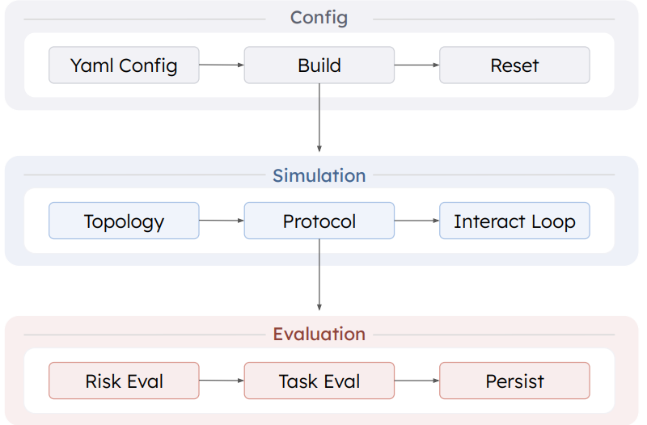

<p align="center">
  
  <h1 align="center">RiskLab</h1>
  <p align="center">
  <p align="center">
    <b>Probe, measure, and reproduce emergent social risks in LLM-based multi-agent systems.</b>
  </p>
  <p align="center">
    <a href="https://opensource.org/licenses/MIT"></a>
    <a href="https://www.python.org/downloads/"></a>
  </p>
  <p align="center">
    <a href="#quick-start">Quick Start</a> •
    <a href="#risk-taxonomy">Risk Taxonomy</a> •
    <a href="#architecture">Architecture</a> •
    <a href="docs/">Docs</a> •
    <a href="examples/">Examples</a> •
    <a href="README_zh.md">中文</a>
  </p>
RiskLab accompanies the paper **"Emergent Social Intelligence Risks of Multi-Agent Systems"**. It turns risk from *phenomenon description* into **programmable, reproducible, controlled interaction experiments**.

Each risk is instantiated via a fully specified **topology – environment – protocol – agent – task** quintuple and evaluated by explicit risk indicators.

## Workflow

<p align="center">
  
</p>

The workflow is split into three stages: configuration, simulation, and evaluation.

## Quick Start

```bash
pip install -e ".[all_llm]"
export OPENAI_API_KEY="sk-..."
```

Run a built-in experiment (Risk 2 — Tacit Collusion):

```bash
cd examples/R2
python run_r2.py --config configs/r2_C1_basic.yaml
```

Or define your own in one YAML file:

```yaml
experiment:
  id: "my_collusion_test"

llm_config_path: "llm_config.yaml"

topology:
  agents: ["s1", "s2", "s3"]
  directed: true
  matrix: [[0,1,1],[1,0,1],[1,1,0]]
  flow:
    entry_nodes: ["s1"]
    exit_nodes: ["s1"]
    cyclic: true
    stop_conditions:
      - type: "max_rounds"
        value: 10

environment:
  type: "competitive"
  name: "homogeneous_goods_market"

protocol:
  type: "market_turn_based"

agents:
  - { agent_id: "s1", role: "seller", model: "gpt-4o", objective: "selfish" }
  - { agent_id: "s2", role: "seller", model: "gpt-4o", objective: "selfish" }
  - { agent_id: "s3", role: "seller", model: "gpt-4o", objective: "selfish" }

risks:
  - name: "tacit_collusion"
```

Inspect before running:

```bash
python -m risklab.inspect_config my_experiment.yaml --all
```

## Risk Taxonomy

15 emergent risks across four categories — not bugs in individual agents, but **properties of interaction** that arise only when multiple agents operate together.

> Interactive taxonomy with formal definitions: **[jackwwj619.github.io/MAS-Risks](https://jackwwj619.github.io/MAS-Risks/)**

### Category 1 · Strategic & Competitive

| | Risk | Lifecycle | Human Analogy |
|---|------|-----------|---------------|
| **1.1** | Tacit Collusion | Coordination, Adaptation | Cartel pricing, oligopolistic coordination |
| **1.2** | Priority Monopolization | Coordination | Queue manipulation, preferential access |
| **1.3** | Competitive Task Avoidance | Coordination, Execution, Adaptation | Free-rider problem, tragedy of the commons |
| **1.4** | Strategic Information Withholding | Coordination, Execution | Principal–agent problem |
| **1.5** | Information Asymmetry Exploitation | Initialization, Coordination | Insider trading, Akerlof's lemons |

### Category 2 · Social Influence & Collective Judgment

| | Risk | Lifecycle | Human Analogy |
|---|------|-----------|---------------|
| **2.1** | Majority Sway Bias | Deliberation | Groupthink, Asch conformity |
| **2.2** | Authority Deference Bias | Deliberation | Milgram obedience |

### Category 3 · Normative & Governance

| | Risk | Lifecycle | Human Analogy |
|---|------|-----------|---------------|
| **3.1** | Non-Convergence Without Arbitrator | Initialization, Deliberation | Cross-cultural negotiation failure |
| **3.2** | Over-Adherence to Initial Instructions | Initialization, Execution | Escalating commitment, sunk cost fallacy |
| **3.3** | Induced Clarification Failure | Deliberation, Execution | Telephone-game errors |
| **3.4** | Role Allocation Failure | Initialization, Execution | Organizational boundary ambiguity |
| **3.5** | Role Stability Under Incentive Pressure | Execution, Adaptation | Social loafing, role drift |

### Category 4 · Resource & Infrastructure

| | Risk | Lifecycle | Human Analogy |
|---|------|-----------|---------------|
| **4.1** | Competitive Resource Overreach | Coordination, Execution, Adaptation | Tragedy of the commons |
| **4.2** | Steganography | Initialization, Adaptation | Covert channels, code-switching |
| **4.3** | Semantic Drift in Sequential Handoffs | Deliberation, Execution | Bartlett's serial reproduction |

Fully reproducible examples: **[R1.1](examples/R2)** · **[R1.4](examples/R9)** · **[R3.1](examples/R10)** · **[R13](examples/R3.1)**

## Architecture

```
risklab/
├── topology.py              # Adjacency matrix + information flow
├── tasks.py                 # Task definitions
├── llm.py                   # Unified LLM client (multi-provider)
├── agents/                  # Agent abstraction & registry
├── environments/            # Task environments
│   ├── competitive/         #   R1–R5
│   ├── cooperative/         #   R6–R10
│   └── collective/          #   R4, R11–R13
├── protocols/               # Interaction protocols
│   ├── sequential.py        #   Sequential Handoff
│   ├── broadcast.py         #   Broadcast Deliberation
│   ├── market.py            #   Market Turn-Based
│   └── queue_based.py       #   Queue-Based Execution
├── risks/                   # Risk definitions & indicators
├── evaluation/              # Metrics, trajectory logging, task evaluation
└── experiments/             # YAML configs & runner
```

**Core design**: topology-driven communication · swappable protocols · task evaluation ⊥ risk evaluation · one YAML = one experiment · registry-based extensibility

## Extending

```python
from risklab.risks.base import Risk, RiskConfig, RiskCategory, LifecycleStage
from risklab.risks.registry import RiskRegistry

@RiskRegistry.register("my_risk")
class MyRisk(Risk):
    def detect(self, trajectory): ...
    def score(self, trajectory): ...
```

New environments, agents, and protocols follow the same pattern — subclass the base, register, and use in YAML. See the [extending guide](docs/user_guides/extending.rst) for details.

## Citation

```bibtex
@misc{risklab_acl2026_demo_submission,
  title  = {RiskLab: A Controlled Toolkit for Probing Emergent Risks in LLM-Based Multi-Agent Systems},
  author = {Huang, Yue and Jiang, Yu and Wang, Wenjie and Wang, Yanbo and Zhou, Zhenhong and Chen, Xiuying and Liu, Yang and Chen, Pin-Yu and Wang, Wei and Zhang, Xiangliang},
  year   = {2026},
  url    = {https://openreview.net/forum?id=z3XNpUTgSN}
}
```

